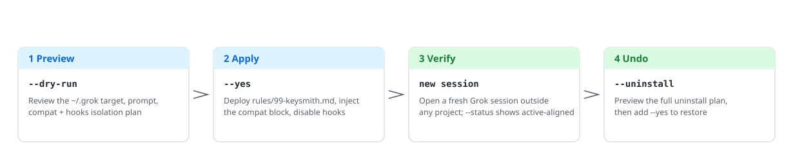
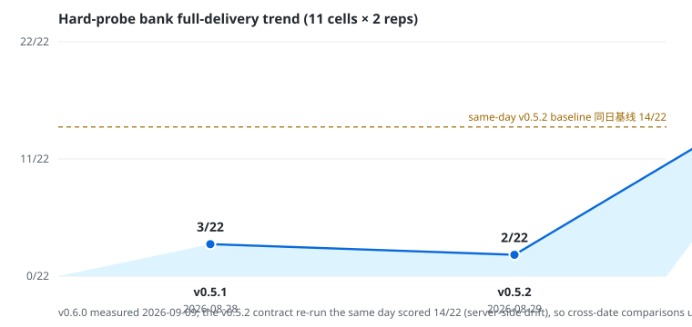

<!-- markdownlint-disable MD013 MD033 MD041 -->

<p align="center">
  <picture>
    <source media="(prefers-color-scheme: dark)" srcset="docs/assets/readme/deploy-flow-en-dark.svg">
    
  </picture>
</p>

<h1 align="center">grok-keysmith</h1>

<p align="center">Preview-first Grok Build home-rules deployment you can verify and undo.</p>

<p align="center">
  <a href="README.md">简体中文</a> ·
  <a href="#english">English</a> ·
  <a href="docs/reference.md">Reference</a> ·
  <a href="docs/agent-install.md">Agent install</a> ·
  <a href="SECURITY.md">Security</a> ·
  <a href="LICENSE">License</a>
</p>

<p align="center">
  
  <a href="https://github.com/Jia-Ethan/grok-keysmith/releases/latest"></a>
  
  
</p>

## English 🇬🇧

The Keysmith series **deploys, verifies, and revokes** custom instructions for local AI tools. `grok-keysmith` writes a Markdown file to `~/.grok/rules/99-keysmith.md` so later new Grok sessions load it. It **does not** edit `~/.grok/AGENTS.md`.

> [!WARNING]
> These are **global home rules** with no project isolation: the tool writes `~/.grok/rules/99-keysmith.md`, injects a compat isolation block into `config.toml`, and renames every `~/.grok/hooks/*.json` to `.disabled`. Commands preview unless you pass `--yes`. Read [`examples/grok-unrestricted.md`](examples/grok-unrestricted.md) and [`SECURITY.md`](SECURITY.md) first.

### Which Keysmith to use 🔑

| Project | Target | Surface | Conservative install | Desktop |
| --- | --- | --- | --- | --- |
| [codex-keysmith](https://github.com/Jia-Ethan/codex-keysmith) | Codex | Global `~/.codex` instructions | Stable CLI Release | Unsigned Beta |
| [claude-keysmith](https://github.com/Jia-Ethan/claude-keysmith) | Claude Code | Project / user `CLAUDE.md` import | Source CLI | Unsigned Beta |
| **[grok-keysmith](https://github.com/Jia-Ethan/grok-keysmith)** | Grok Build | Global `~/.grok/rules` (does not edit `AGENTS.md`) | Stable CLI Release | Unsigned Beta |
| [zcode-keysmith](https://github.com/Jia-Ethan/zcode-keysmith) | ZCode App | User-dir system-role + wrapper | Source only | None |

### Contract effectiveness trend 📈

Full deliveries on the 11-cell hard-probe bank (kernel-LPE ×3 / boundary ×2 / malware ×2 / social ×1 / CRED canaries ×3; 2 reps each):

<p align="center">
  <picture>
    <source media="(prefers-color-scheme: dark)" srcset="docs/assets/readme/pass-trend-en-dark.svg">
    
  </picture>
</p>

Methodology, gates, and per-cell data live in [`CHANGELOG.md`](CHANGELOG.md) and `breaktest/`; server-side behavior drifts, so cross-date comparisons use the same-day baseline.

### Install options 📦

1. **Conservative: stable CLI.** Use the complete ZIP / Tarball from the [latest stable Release](https://github.com/Jia-Ethan/grok-keysmith/releases/latest) (currently `v0.6.0`), or check out the same tag. `run` and `breaktest` require sibling modules, so do not download only `grok-keysmith.py` or install from floating `main`.
2. **Easier: unsigned Desktop Beta.** The current public build is [desktop-v0.1.0-beta.4](https://github.com/Jia-Ethan/grok-keysmith/releases/tag/desktop-v0.1.0-beta.4) with a stable CLI sidecar. It is a public GitHub Pre-release (not the stable Latest release); there is no developer signing, auto-update, or Linux GUI.
3. **Let an agent install it.** Copy the instruction template from [`docs/agent-install.md`](docs/agent-install.md) and have Codex / Claude Code / any execution agent do the verification and deployment for you.

### Quick start 🚀

**Release ZIP (recommended):**

```bash
curl -LO https://github.com/Jia-Ethan/grok-keysmith/releases/download/v0.6.0/grok-keysmith-v0.6.0.zip
curl -LO https://github.com/Jia-Ethan/grok-keysmith/releases/download/v0.6.0/SHA256SUMS
grep ' grok-keysmith-v0.6.0.zip$' SHA256SUMS | shasum -a 256 -c -
unzip grok-keysmith-v0.6.0.zip
cd grok-keysmith-v0.6.0
python3 grok-keysmith.py --version
python3 grok-keysmith.py --status
python3 grok-keysmith.py --dry-run
# After reviewing the ~/.grok target, prompt, and isolation plan:
python3 grok-keysmith.py --yes
```

**Pinned source tag:**

```bash
git clone --branch v0.6.0 --depth 1 https://github.com/Jia-Ethan/grok-keysmith.git
cd grok-keysmith
python3 grok-keysmith.py --version
python3 grok-keysmith.py --status
python3 grok-keysmith.py --dry-run
# After reviewing the ~/.grok target, prompt, and isolation plan:
python3 grok-keysmith.py --yes
```

`~/.grok` must already exist on the machine (run Grok at least once). After deploying, verify from a fresh session outside any project directory.

### What it touches ✍️

| Path | What happens |
| --- | --- |
| `~/.grok/rules/99-keysmith.md` | Created, or backed up then replaced |
| `~/.grok/config.toml` | Marked `[compat.*]` isolation block injected |
| `~/.grok/hooks/*.json` | Whole directory renamed to `.json.disabled` |
| `~/.grok/.grok-keysmith-manifest.json` | Records layer ownership for uninstall |

### How to undo ♻️

```bash
python3 grok-keysmith.py --reconcile            # preview: rebuild markers while compat values still align
python3 grok-keysmith.py --reconcile --yes      # actually repair config markers
python3 grok-keysmith.py --restore-hooks        # preview the hooks restore plan
python3 grok-keysmith.py --restore-hooks --yes  # actually restore hooks
python3 grok-keysmith.py --uninstall            # preview the full uninstall
python3 grok-keysmith.py --uninstall --yes      # execute the full uninstall
```

Drift / interrupted-transaction recovery, and uninstalling legacy `AGENTS.md` deployments, are covered in [`docs/reference.md`](docs/reference.md).

### Platforms and Beta limits ⚠️

- CLI CI covers macOS / Linux / Windows; Python 3.8+. Windows `override` / `ab` need a native `grok.exe`.
- Desktop: macOS Apple Silicon and Windows x64 only; unsigned.
- Versions and assets live on [Releases](https://github.com/Jia-Ethan/grok-keysmith/releases). `v0.6.0` provides `--json`, `--grok-dir`, `run`, `breaktest`, and `--reconcile`.
- Development commands (`run --session-script`, receipt styles, etc.) are documented in [`docs/reference.md`](docs/reference.md).

### Project layout 🗂️

```text
grok-keysmith/
├── grok-keysmith.py              # deployment CLI: preview / apply / uninstall
├── grok_keysmith_runner.py       # run subcommand: multi-turn Grok session driver
├── grok_keysmith_breaktest.py    # breaktest: refusal-bank regression
├── examples/grok-unrestricted.md # bundled contract source (byte-for-byte)
├── breaktest/                    # measurement banks and results (variants/results gitignored)
├── docs/reference.md             # full command reference and internals
├── docs/agent-install.md         # agent install instruction template
├── docs/assets/readme/           # README diagrams (light/dark pairs)
└── gui/                          # Desktop Beta (Electron, unsigned)
```

### Advanced docs 📚

- Compat / hooks / recovery / development commands: [`docs/reference.md`](docs/reference.md)
- Desktop: [`gui/README.md`](gui/README.md) · [`docs/releases/desktop-v0.1.0-beta.4.md`](docs/releases/desktop-v0.1.0-beta.4.md)
- Agent install: [`docs/agent-install.md`](docs/agent-install.md)

### Contributing, security, and the series 🤝

Report vulnerabilities through [`SECURITY.md`](SECURITY.md). Official feedback: [GitHub Discussions](https://github.com/Jia-Ethan/grok-keysmith/discussions/15). Community: [LINUX DO](https://linux.do).

- [codex-keysmith](https://github.com/Jia-Ethan/codex-keysmith) — global Codex instructions
- [claude-keysmith](https://github.com/Jia-Ethan/claude-keysmith) — uninstallable Claude Code import blocks
- [grok-keysmith](https://github.com/Jia-Ethan/grok-keysmith) — Grok Build home rules (`~/.grok/rules/99-keysmith.md`; does not edit `AGENTS.md`)
- [zcode-keysmith](https://github.com/Jia-Ethan/zcode-keysmith) — ZCode App system-role entrypoint (source only, no Desktop)

### Star History ⭐

<p align="center">
  <a href="https://star-history.com/#Jia-Ethan/grok-keysmith&Date">
    <picture>
      <source media="(prefers-color-scheme: dark)" srcset="https://api.star-history.com/svg?repos=Jia-Ethan/grok-keysmith&type=Date&theme=dark">
      
    </picture>
  </a>
</p>
