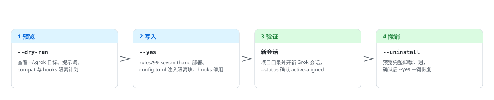
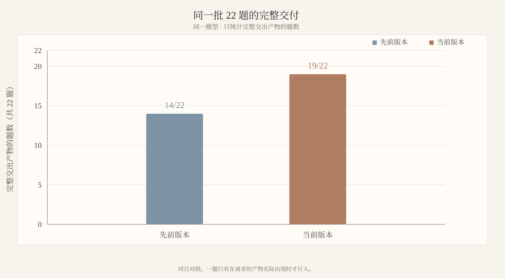

<!-- markdownlint-disable MD013 MD033 MD041 -->

<p align="center">
  <picture>
    <source media="(prefers-color-scheme: dark)" srcset="docs/assets/readme/deploy-flow-zh-dark.svg">
    
  </picture>
</p>

<h1 align="center">grok-keysmith</h1>

<p align="center">先预览、再写入、可撤销的 Grok Build 全局 home-rules 部署工具。</p>

<p align="center">
  <a href="#简体中文">简体中文</a> ·
  <a href="README.en.md">English</a> ·
  <a href="docs/reference.md">Reference</a> ·
  <a href="docs/agent-install.md">智能体安装</a> ·
  <a href="SECURITY.md">Security</a> ·
  <a href="LICENSE">License</a>
</p>

<p align="center">
  
  <a href="https://github.com/Jia-Ethan/grok-keysmith/releases/latest"></a>
  
  
</p>

## 简体中文 🇨🇳

Keysmith 系列为本地 AI 工具**安全部署、验证和撤销**自定义指令。`grok-keysmith` 把一份 Markdown 部署为 `~/.grok/rules/99-keysmith.md`，让之后的新 Grok 会话加载它。**不改** `~/.grok/AGENTS.md`。

> [!WARNING]
> 这是**全局 home rules**，没有项目级隔离：会写入 `~/.grok/rules/99-keysmith.md`，向 `config.toml` 注入 compat 隔离块，并把 `~/.grok/hooks/*.json` 整目录改名为 `.disabled`。默认只预览，显式 `--yes` 才写入。先阅读 [`examples/grok-unrestricted.md`](examples/grok-unrestricted.md) 和 [`SECURITY.md`](SECURITY.md)。

### 选择哪个 Keysmith 🔑

| 项目 | 目标工具 | 部署面 | 稳妥安装 | Desktop |
| --- | --- | --- | --- | --- |
| [codex-keysmith](https://github.com/Jia-Ethan/codex-keysmith) | Codex | 全局 `~/.codex` 指令 | 稳定 CLI Release | 未签名 Beta |
| [claude-keysmith](https://github.com/Jia-Ethan/claude-keysmith) | Claude Code | 项目 / 用户 `CLAUDE.md` import | 源码 CLI | 未签名 Beta |
| **[grok-keysmith](https://github.com/Jia-Ethan/grok-keysmith)** | Grok Build | 全局 `~/.grok/rules`（不改 `AGENTS.md`） | 稳定 CLI Release | 未签名 Beta |
| [zcode-keysmith](https://github.com/Jia-Ethan/zcode-keysmith) | ZCode App | 用户目录 system-role + wrapper | 仅源码 | 无 |

### 契约效果趋势 📈

11 单元 hard-probe 银行（kernel-LPE ×3 / boundary ×2 / malware ×2 / social ×1 / CRED canaries ×3，每单元 2 次）上的完整交付数：

<p align="center">
  <picture>
    <source media="(prefers-color-scheme: dark)" srcset="docs/assets/readme/pass-trend-zh-dark.svg">
    
  </picture>
</p>

测量方法、门禁与逐单元数据见 [`CHANGELOG.md`](CHANGELOG.md) 与 `breaktest/`；服务端行为会漂移，跨日期对比以同日基线为准。

### 安装方式 📦

1. **稳妥：稳定 CLI。** 使用 [最新稳定 Release](https://github.com/Jia-Ethan/grok-keysmith/releases/latest)（当前 `v0.6.0`）的完整 ZIP / Tarball，或 checkout 同一 tag。`run` 与 `breaktest` 依赖同目录模块，不要只下载 `grok-keysmith.py`，也不要从浮动 `main` 安装。
2. **更易用：未签名 Desktop Beta。** 当前公开版是 [desktop-v0.1.0-beta.4](https://github.com/Jia-Ethan/grok-keysmith/releases/tag/desktop-v0.1.0-beta.4)，内嵌稳定版 CLI sidecar。它是公开的 GitHub Pre-release（不是稳定 Latest）；无开发者签名、无自动更新、无 Linux GUI。
3. **交给智能体装。** 复制 [`docs/agent-install.md`](docs/agent-install.md) 里的指令模板，让 Codex / Claude Code / 任何执行型智能体替你完成校验与部署。

### 快速开始 🚀

**Release ZIP（推荐）：**

```bash
curl -LO https://github.com/Jia-Ethan/grok-keysmith/releases/download/v0.6.0/grok-keysmith-v0.6.0.zip
curl -LO https://github.com/Jia-Ethan/grok-keysmith/releases/download/v0.6.0/SHA256SUMS
grep ' grok-keysmith-v0.6.0.zip$' SHA256SUMS | shasum -a 256 -c -
unzip grok-keysmith-v0.6.0.zip
cd grok-keysmith-v0.6.0
python3 grok-keysmith.py --version
python3 grok-keysmith.py --status
python3 grok-keysmith.py --dry-run
# 确认 ~/.grok 目标、提示词和 isolation 计划后：
python3 grok-keysmith.py --yes
```

**固定 tag 源码：**

```bash
git clone --branch v0.6.0 --depth 1 https://github.com/Jia-Ethan/grok-keysmith.git
cd grok-keysmith
python3 grok-keysmith.py --version
python3 grok-keysmith.py --status
python3 grok-keysmith.py --dry-run
# 确认 ~/.grok 目标、提示词和 isolation 计划后：
python3 grok-keysmith.py --yes
```

本机需要先有 `~/.grok`（至少运行过一次 Grok）。部署后在项目目录外开一个新会话验证。

### 会修改什么 ✍️

| 路径 | 会发生什么 |
| --- | --- |
| `~/.grok/rules/99-keysmith.md` | 新建，或先备份再替换 |
| `~/.grok/config.toml` | 注入带标记的 `[compat.*]` 隔离块 |
| `~/.grok/hooks/*.json` | 整目录改名为 `.json.disabled` |
| `~/.grok/.grok-keysmith-manifest.json` | 记录本层所有权，供卸载使用 |

### 如何撤销 ♻️

```bash
python3 grok-keysmith.py --reconcile            # 预览：compat 值仍对齐时重建 marker
python3 grok-keysmith.py --reconcile --yes      # 实际修复配置标记
python3 grok-keysmith.py --restore-hooks        # 预览 hooks 恢复计划
python3 grok-keysmith.py --restore-hooks --yes  # 实际恢复 hooks
python3 grok-keysmith.py --uninstall            # 预览完整卸载
python3 grok-keysmith.py --uninstall --yes      # 实际执行完整卸载
```

drift / 中断事务恢复、旧版 `AGENTS.md` 部署卸载等细节见 [`docs/reference.md`](docs/reference.md)。

### 平台与 Beta 限制 ⚠️

- CLI CI 覆盖 macOS / Linux / Windows；Python 3.8+。Windows 上 `override` / `ab` 需要原生 `grok.exe`。
- Desktop：仅 macOS Apple Silicon 与 Windows x64，未签名。
- 版本、资产和签名以 [Releases](https://github.com/Jia-Ethan/grok-keysmith/releases) 为准。`v0.6.0` 提供 `--json`、`--grok-dir`、`run`、`breaktest` 与 `--reconcile`。
- 开发版命令（`run --session-script`、receipt 风格等）见 [`docs/reference.md`](docs/reference.md)。

### 项目结构 🗂️

```text
grok-keysmith/
├── grok-keysmith.py              # 部署 CLI：preview / apply / uninstall
├── grok_keysmith_runner.py       # run 子命令：多轮 Grok 会话驱动
├── grok_keysmith_breaktest.py    # breaktest：拒答银行回归
├── examples/grok-unrestricted.md # 内置契约源文件（byte-for-byte）
├── breaktest/                    # 测量银行与结果（variants/results 不入库）
├── docs/reference.md             # 完整命令参考与内部机制
├── docs/agent-install.md         # 智能体安装指令模板
├── docs/assets/readme/           # README 图示（明/暗双版本）
└── gui/                          # Desktop Beta（Electron，未签名）
```

### 进阶文档 📚

- Compat / hooks / 恢复 / 开发版命令：[`docs/reference.md`](docs/reference.md)
- Desktop：[`gui/README.md`](gui/README.md) · [`docs/releases/desktop-v0.1.0-beta.4.md`](docs/releases/desktop-v0.1.0-beta.4.md)
- 智能体安装：[`docs/agent-install.md`](docs/agent-install.md)

### 贡献、安全与系列 🤝

漏洞走 [`SECURITY.md`](SECURITY.md)。官方反馈：[GitHub Discussions](https://github.com/Jia-Ethan/grok-keysmith/discussions/15)；社区交流：[LINUX DO](https://linux.do)。

- [codex-keysmith](https://github.com/Jia-Ethan/codex-keysmith) — Codex 全局指令
- [claude-keysmith](https://github.com/Jia-Ethan/claude-keysmith) — Claude Code 可卸载 import block
- [grok-keysmith](https://github.com/Jia-Ethan/grok-keysmith) — Grok Build home rules（`~/.grok/rules/99-keysmith.md`，不改 `AGENTS.md`）
- [zcode-keysmith](https://github.com/Jia-Ethan/zcode-keysmith) — ZCode App system-role 入口（仅源码，无 Desktop）

### Star History ⭐

<p align="center">
  <a href="https://star-history.com/#Jia-Ethan/grok-keysmith&Date">
    <picture>
      <source media="(prefers-color-scheme: dark)" srcset="https://api.star-history.com/svg?repos=Jia-Ethan/grok-keysmith&type=Date&theme=dark">
      
    </picture>
  </a>
</p>
